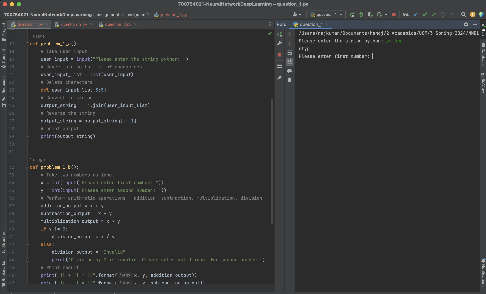
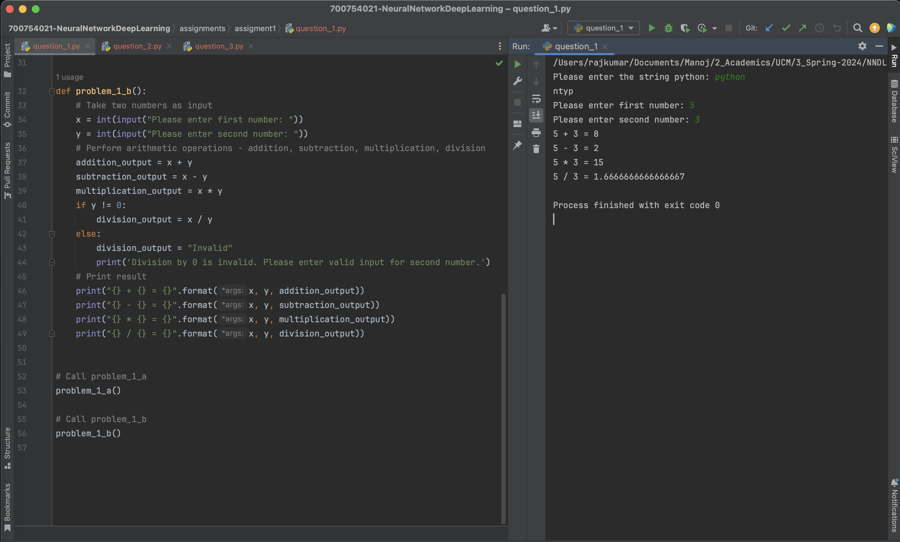
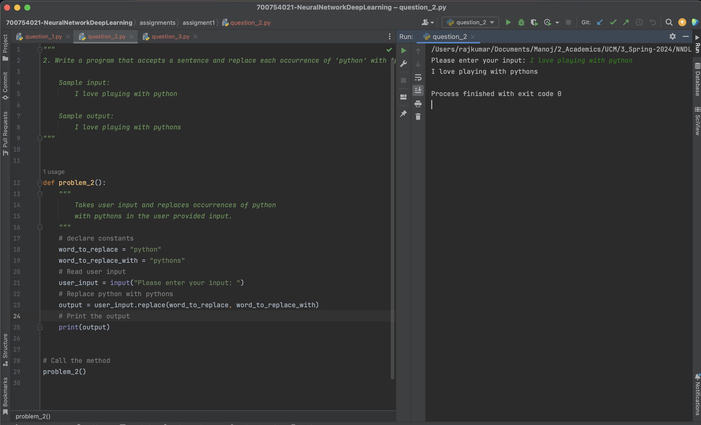
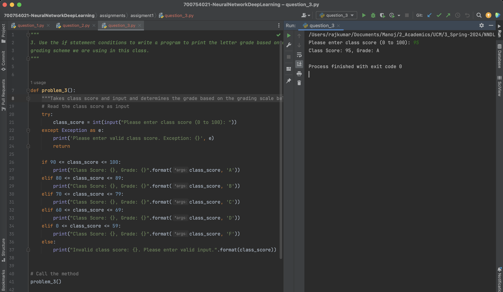

# Assignment 1 :: ICP-1

[PDF Document][1]  
[Short Video][2]

## Table of Contents

1. [Introduction](#introduction)
2. [Basic Details](#basic-details)
3. [Requirements](#requirements)
4. [Instructions](#instructions) 
5. [Solutions](#solutions)
6. [Screenshots](#screenshots)
7. [Recordings](#recordings)

## Introduction

Assignment 1 comprises of 3 questions containing code in individual files
+ question_1.py
+ question_2.py
+ question_3.py

## Basic Details
| Attribute  | Value                                  | 
|------------|----------------------------------------|
| Name       | Manoj Bala                             |
| Email      | mxb40210@ucmo.edu                      |
| Student Id | 700754021                              |
| CRN        | 23441                                  |
| Course     | CS5720 Neural Networks & Deep Learning |

## Requirements

| Python     | https://www.python.org/            | 
|------------|------------------------------------|
| Pycharm    | https://www.jetbrains.com/pycharm/ |

## Instructions

1. Clone the repository
`git clone git@github.com:mxb40210/700754021-NeuralNetworkDeepLearning.git`
2. Import the project in PyCharm or IDE of your choice
3. Right-click the `<filename>.py` -> Select Run (or) `python3 <filename>.py`

## Solutions

### Solution 1 a
```
    # Take user input
    user_input = input("Please enter the string python: ")
    # Covert string to list of characters
    user_input_list = list(user_input)
    # Delete characters
    del user_input_list[3:5]
    # Convert to string
    output_string = ''.join(user_input_list)
    # Reverse the string
    output_string = output_string[::-1]
    # print output
    print(output_string)
```

### Solution 1 b
```
    # Take two numbers as input
    x = int(input("Please enter first number: "))
    y = int(input("Please enter second number: "))
    # Perform arithmetic operations - addition, subtraction, multiplication, division
    addition_output = x + y
    subtraction_output = x - y
    multiplication_output = x * y
    if y != 0:
        division_output = x / y
    else:
        division_output = "Invalid"
        print('Division by 0 is invalid. Please enter valid input for second number.')
    # Print result
    print("{} + {} = {}".format(x, y, addition_output))
    print("{} - {} = {}".format(x, y, subtraction_output))
    print("{} * {} = {}".format(x, y, multiplication_output))
    print("{} / {} = {}".format(x, y, division_output))
```

### Solution 2
```
    # declare constants
    word_to_replace = "python"
    word_to_replace_with = "pythons"
    # Read user input
    user_input = input("Please enter your input: ")
    # Replace python with pythons
    output = user_input.replace(word_to_replace, word_to_replace_with)
    # Print the output
    print(output)
```

### Solution 3
```
    try:
        class_score = int(input("Please enter class score (0 to 100): "))
    except Exception as e:
        print('Please enter valid class score. Exception: {}', e)
        return

    if 90 <= class_score <= 100:
        print("Class Score: {}, Grade: {}".format(class_score, 'A'))
    elif 80 <= class_score <= 89:
        print("Class Score: {}, Grade: {}".format(class_score, 'B'))
    elif 70 <= class_score <= 79:
        print("Class Score: {}, Grade: {}".format(class_score, 'C'))
    elif 60 <= class_score <= 69:
        print("Class Score: {}, Grade: {}".format(class_score, 'D'))
    elif 0 <= class_score <= 59:
        print("Class Score: {}, Grade: {}".format(class_score, 'F'))
    else:
        print("Invalid class score: {}. Please enter valid input.".format(class_score))
```

## Screenshots









## Recordings

[][2]

[1]: https://github.com/mxb40210/700754021-NeuralNetworkDeepLearning/blob/main/assignments/assignment1/23441_700754021_ICP-1.pdf
[2]: https://drive.google.com/file/d/1FbU-bgx_xCo_Suo_uFXL0Kpx1Kv_eZOR/view?usp=sharing