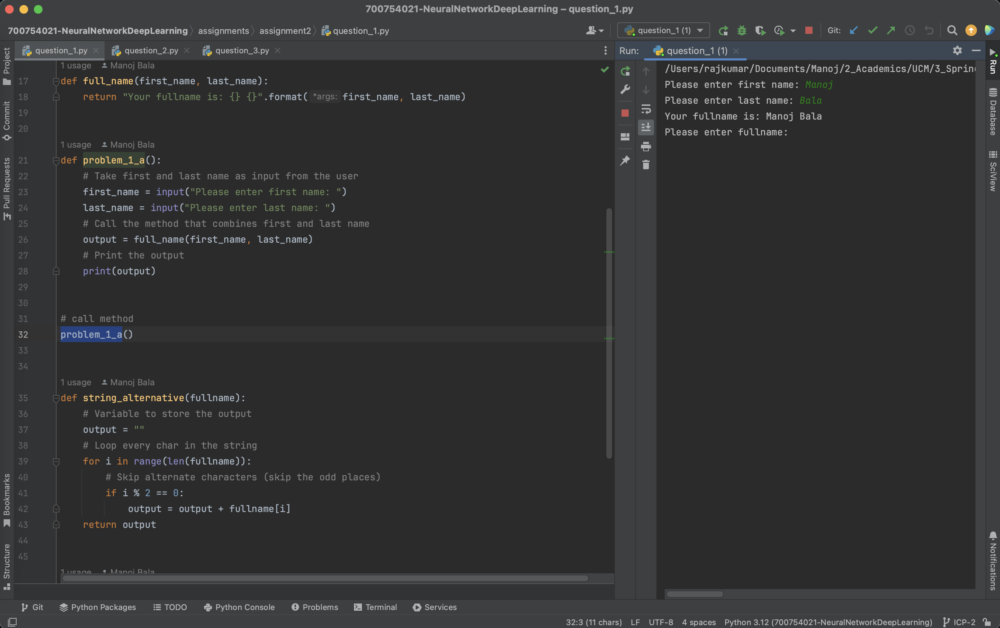
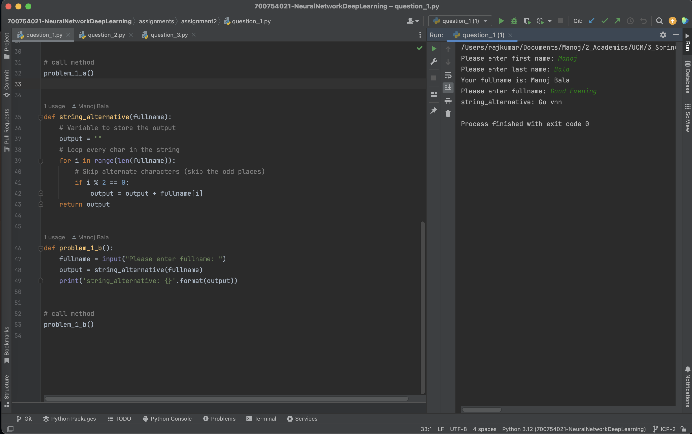
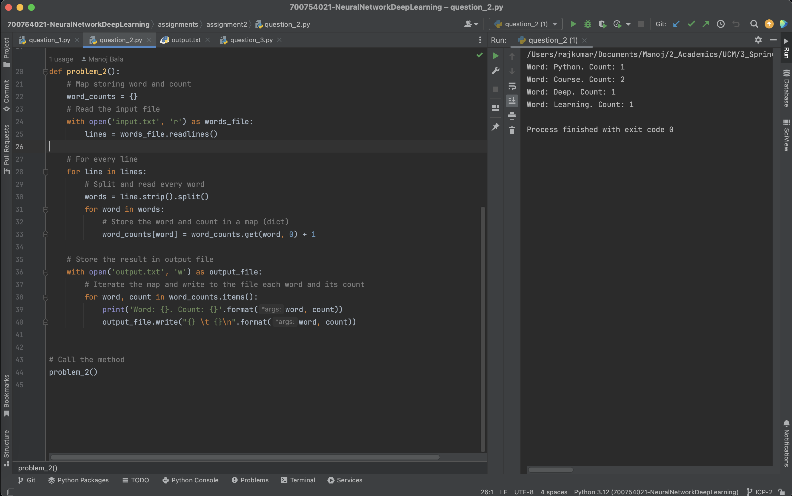
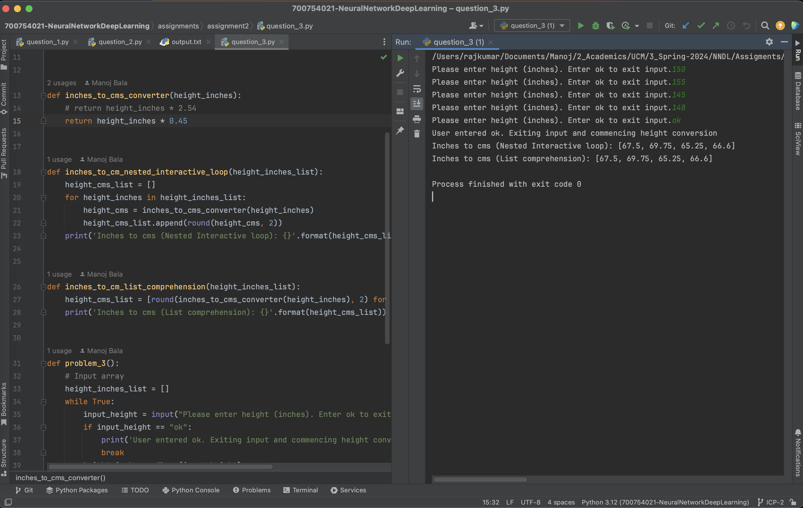

# Assignment 2 :: ICP-2

[PDF Document][1]  
[Short Video][2]

## Table of Contents

1. [Introduction](#introduction)
2. [Basic Details](#basic-details)
3. [Requirements](#requirements)
4. [Instructions](#instructions) 
5. [Solutions](#solutions)
6. [Screenshots](#screenshots)
7. [Recordings](#recordings)

## Introduction

Assignment 2 comprises of 3 questions containing code in individual files
+ question_1.py
+ question_2.py
+ question_3.py

## Basic Details
| Attribute  | Value                                  | 
|------------|----------------------------------------|
| Name       | Manoj Bala                             |
| Email      | mxb40210@ucmo.edu                      |
| Student Id | 700754021                              |
| CRN        | 23441                                  |
| Course     | CS5720 Neural Networks & Deep Learning |

## Requirements

| Python     | https://www.python.org/            | 
|------------|------------------------------------|
| Pycharm    | https://www.jetbrains.com/pycharm/ |

## Instructions

1. Clone the repository
`git clone git@github.com:mxb40210/700754021-NeuralNetworkDeepLearning.git`
2. Import the project in PyCharm or IDE of your choice
3. Right-click the `<filename>.py` -> Select Run (or) `python3 <filename>.py`

## Solutions

### Solution 1 a
```
    def full_name(first_name, last_name):
        return "Your fullname is: {} {}".format(first_name, last_name)


    def problem_1_a():
        # Take first and last name as input from the user
        first_name = input("Please enter first name: ")
        last_name = input("Please enter last name: ")
        # Call the method that combines first and last name
        output = full_name(first_name, last_name)
        # Print the output
        print(output)


    # call method
    problem_1_a()
```

### Solution 1 b
```
    def string_alternative(fullname):
        # Variable to store the output
        output = ""
        # Loop every char in the string
        for i in range(len(fullname)):
            # Skip alternate characters (skip the odd places)
            if i % 2 == 0:
                output = output + fullname[i]
        return output


    def problem_1_b():
        fullname = input("Please enter fullname: ")
        output = string_alternative(fullname)
        print('string_alternative: {}'.format(output))


    # call method
    problem_1_b()
```

### Solution 2
```
    # Map storing word and count
    word_counts = {}
    # Read the input file
    with open('input.txt', 'r') as words_file:
        lines = words_file.readlines()

    # For every line
    for line in lines:
        # Split and read every word
        words = line.strip().split()
        for word in words:
            # Store the word and count in a map (dict)
            word_counts[word] = word_counts.get(word, 0) + 1

    # Store the result in output file
    with open('output.txt', 'w') as output_file:
        # Iterate the map and write to the file each word and its count
        for word, count in word_counts.items():
            print('Word: {}. Count: {}'.format(word, count))
            output_file.write("{} \t {}\n".format(word, count))
```

### Solution 3
```
    def inches_to_cms_converter(height_inches):
    # return height_inches * 2.54
    return height_inches * 0.45


    def inches_to_cm_nested_interactive_loop(height_inches_list):
        height_cms_list = []
        for height_inches in height_inches_list:
            height_cms = inches_to_cms_converter(height_inches)
            height_cms_list.append(round(height_cms, 2))
        print('Inches to cms (Nested Interactive loop): {}'.format(height_cms_list))
    
    
    def inches_to_cm_list_comprehension(height_inches_list):
        height_cms_list = [round(inches_to_cms_converter(height_inches), 2) for height_inches in height_inches_list]
        print('Inches to cms (List comprehension): {}'.format(height_cms_list))
    
    
    def problem_3():
        # Input array
        height_inches_list = []
        while True:
            input_height = input("Please enter height (inches). Enter ok to exit input.")
            if input_height == "ok":
                print('User entered ok. Exiting input and commencing height conversion')
                break
            height_inches = float(input_height)
            height_inches_list.append(height_inches)
    
        # Approach 1 : Using Nested Interactive Loop
        inches_to_cm_nested_interactive_loop(height_inches_list)
    
        # Approach 2 : Using List Comprehension
        inches_to_cm_list_comprehension(height_inches_list)
    
    
    # Call the method
    problem_3()
```

## Screenshots









## Recordings

[][2]

[1]: https://github.com/mxb40210/700754021-NeuralNetworkDeepLearning/blob/main/assignments/assignment2/23441_700754021_ICP-2.pdf
[2]: https://drive.google.com/file/d/1AIlZtKgCrUqvPMf22wwt894BaahSuVw7/view?usp=sharing
