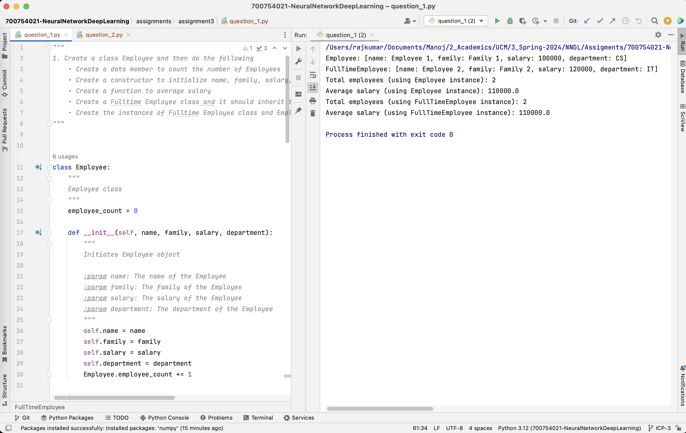
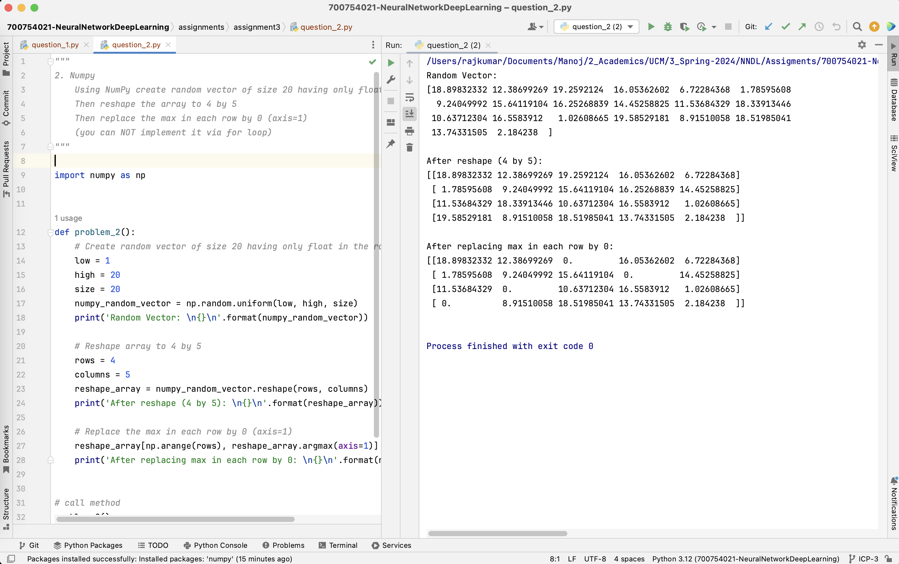

# Assignment 3 :: ICP-3

[PDF Document][1]  
[Short Video][2]

## Table of Contents

1. [Introduction](#introduction)
2. [Basic Details](#basic-details)
3. [Requirements](#requirements)
4. [Instructions](#instructions) 
5. [Solutions](#solutions)
6. [Screenshots](#screenshots)
7. [Recordings](#recordings)

## Introduction

Assignment 3 comprises of 2 questions containing code in individual files
+ question_1.py
+ question_2.py

## Basic Details
| Attribute  | Value                                  | 
|------------|----------------------------------------|
| Name       | Manoj Bala                             |
| Email      | mxb40210@ucmo.edu                      |
| Student Id | 700754021                              |
| CRN        | 23441                                  |
| Course     | CS5720 Neural Networks & Deep Learning |

## Requirements

| Python     | https://www.python.org/            | 
|------------|------------------------------------|
| Pycharm    | https://www.jetbrains.com/pycharm/ |

## Instructions

1. Clone the repository
`git clone git@github.com:mxb40210/700754021-NeuralNetworkDeepLearning.git`
2. Import the project in PyCharm or IDE of your choice
3. Right-click the `<filename>.py` -> Select Run (or) `python3 <filename>.py`

## Solutions

### Solution 1
```
    class Employee:
        """
        Employee class
        """
        employee_count = 0
    
        def __init__(self, name, family, salary, department):
            """
            Initiates Employee object
    
            :param name: The name of the Employee
            :param family: The family of the Employee
            :param salary: The salary of the Employee
            :param department: The department of the Employee
            """
            self.name = name
            self.family = family
            self.salary = salary
            self.department = department
            Employee.employee_count += 1
    
        @classmethod
        def get_employee_count(cls):
            """
            The employee count
    
            :return: The count of employees
            """
            return Employee.employee_count
    
        @staticmethod
        def average_salary(employees):
            """
            Computes the average salary for the list of employees provided
    
            :param employees: List of employees
            :return: average salary
            """
            salary = 0
            for employee in employees:
                salary += employee.salary
            return salary / len(employees)
    
        def __str__(self):
            return "Employee: [name: {}, family: {}, salary: {}, department: {}]".format(self.name,
                                                                                         self.family,
                                                                                         self.salary,
                                                                                         self.department)


    class FullTimeEmployee(Employee):
        def __init__(self, name, family, salary, department):
            """
            Initiates FullTimeEmployee object
    
            :param name: The name of the FullTimeEmployee
            :param family: The family of the FullTimeEmployee
            :param salary: The salary of the FullTimeEmployee
            :param department: The department of the FullTimeEmployee
            """
            super().__init__(name, family, salary, department)
    
        def __str__(self):
            """
            FullTimeEmployee details
    
            :return: FullTimeEmployee details as string
            """
            return "FullTimeEmployee: [name: {}, family: {}, salary: {}, department: {}]".format(self.name,
                                                                                                 self.family,
                                                                                                 self.salary,
                                                                                                 self.department)


    def main():
        # Create instance of Employee
        employee_1 = Employee("Employee 1", "Family 1", 100000, "CS")
        # Create instance of FullTimeEmployee
        employee_2 = FullTimeEmployee("Employee 2", "Family 2", 120000, "IT")
    
        # Call member functions
        employees = [employee_1, employee_2]
        # Print Employee
        print(employee_1)
        # Print FullTimeEmployee
        print(employee_2)
        # Get total employees using Employee instance
        print('Total employees (using Employee instance): {}'.format(Employee.get_employee_count()))
        # Get average salary using Employee instance
        print('Average salary (using Employee instance): {}'.format(Employee.average_salary(employees)))
        # Get total employees using FullTimeEmployee instance
        print('Total employees (using FullTimeEmployee instance): {}'.format(FullTimeEmployee.get_employee_count()))
        # Get average salary using FullTimeEmployee instance
        print('Average salary (using FullTimeEmployee instance): {}'.format(FullTimeEmployee.average_salary(employees)))
    
    
    # call main
    if __name__ == '__main__':
        main()
```

### Solution 2
```
    def problem_2():
        # Create random vector of size 20 having only float in the range 1-20.
        low = 1
        high = 20
        size = 20
        numpy_random_vector = np.random.uniform(low, high, size)
        print('Random Vector: \n{}\n'.format(numpy_random_vector))
    
        # Reshape array to 4 by 5
        rows = 4
        columns = 5
        reshape_array = numpy_random_vector.reshape(rows, columns)
        print('After reshape (4 by 5): \n{}\n'.format(reshape_array))
    
        # Replace the max in each row by 0 (axis=1)
        reshape_array[np.arange(rows), reshape_array.argmax(axis=1)] = 0
        print('After replacing max in each row by 0: \n{}\n'.format(reshape_array))
    
    
    # call method
    problem_2()
```


## Screenshots





## Recordings

[][2]

[1]: https://github.com/mxb40210/700754021-NeuralNetworkDeepLearning/blob/main/assignments/assignment3/23441_700754021_ICP-3.pdf
[2]: https://drive.google.com/file/d/1pxfsLM9b1ZcrkKdcNWZ3gZ-s6inAhTXC/view?usp=sharing
