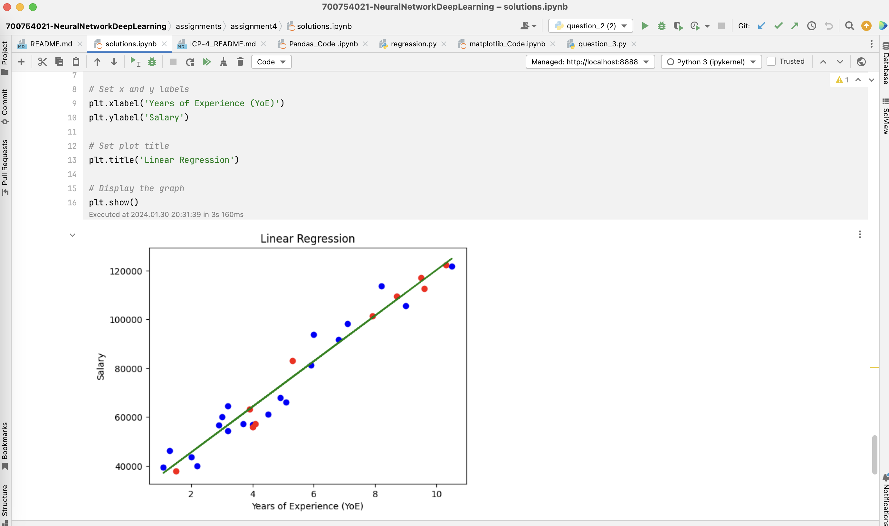

# Assignment 4 :: ICP-4

[PDF Document][1]  
[Short Video][2]

## Table of Contents

1. [Introduction](#introduction)
2. [Basic Details](#basic-details)
3. [Requirements](#requirements)
4. [Instructions](#instructions) 
5. [Solutions](#solutions)
6. [Screenshots](#screenshots)
7. [Recordings](#recordings)

## Introduction

Assignment 4 comprises of 2 questions containing code in single Python Jupyter Notebook named `solutions.ipynb`
+ solutions.ipynb

## Basic Details
| Attribute  | Value                                  | 
|------------|----------------------------------------|
| Name       | Manoj Bala                             |
| Email      | mxb40210@ucmo.edu                      |
| Student Id | 700754021                              |
| CRN        | 23441                                  |
| Course     | CS5720 Neural Networks & Deep Learning |

## Requirements

| Python     | https://www.python.org/            | 
|------------|------------------------------------|
| Pycharm    | https://www.jetbrains.com/pycharm/ |

## Instructions

1. Clone the repository
`git clone git@github.com:mxb40210/700754021-NeuralNetworkDeepLearning.git`
2. Import the project in PyCharm or IDE of your choice
3. Open the Python Jupyter Notebook `solutions.ipynb`
4. Select Run -> Run all cells

## Solutions

### Solution 1
```
    # Imports
    import pandas as pd
    
    # a. Read the provided CSV file ‘data.csv’

    # Path of the csv
    data_path = 'data/data.csv'
    
    # Read csv using pandas
    data_df = pd.read_csv(data_path)
    
    # Shape (rows, columns)
    data_df.shape
    
    # c. Show the basic statistical description about the data.
    data_df.describe()
    
    # d. Check if the data has null values.
    data_df.isnull().sum()
    
    # i. Replace null values with the mean
    data_df.fillna(data_df.mean(), inplace=True)
    
    data_df.isnull().sum()
    
    # e. Select at least two columns and aggregate the data using: min, max, count, mean.

    # Select two columns in a list - Duration & Calories
    aggregate_columns = ['Duration', 'Calories']
    
    # Aggregate the data by min, max, count, mean for these two columns
    aggregated_data = data_df[aggregate_columns].agg(['min', 'max', 'count', 'mean'])
    
    # Print the aggregated
    print(aggregated_data)
    
    # f. Filter the dataframe to select the rows with calories values between 500 and 1000.
    filtered_data_by_calories = data_df[(data_df['Calories'] >= 500) & (data_df['Calories'] <= 1000)]
    print(filtered_data_by_calories)
    
    # g. Filter the dataframe to select the rows with calories values > 500 and pulse < 100.
    filtered_data_df = data_df[(data_df['Calories'] > 500) & (data_df['Pulse'] < 100)]
    print(filtered_data_df)
    
    # h. Create a new “df_modified” dataframe that contains all the columns from df except for “Maxpulse”.
    df_modified = data_df.drop(columns=['Maxpulse'])
    print('data_df columns: {}'.format(data_df.columns))
    print('df_modified columns: {}'.format(df_modified.columns))
    
    # i. Delete the “Maxpulse” column from the main df dataframe
    print('Before deleting maxpulse, data_df columns: {}'.format(data_df.columns))
    data_df.drop(columns=['Maxpulse'], inplace=True)
    print('After deleting maxpulse, data_df columns: {}'.format(data_df.columns))
    
    # j. Convert the datatype of Calories column to int datatype.
    print('Before converting to int, Calorie datatype: {}'.format(data_df['Calories'].dtype))
    data_df['Calories'] = data_df['Calories'].astype(int)
    print('After converting to int, Calorie datatype: {}'.format(data_df['Calories'].dtype))
    
    # k. Using pandas, create a scatter plot for the two columns (Duration and Calories).

    # Import scatterplot
    import matplotlib.pyplot as plt
    
    # Draw basic plot - Duration Vs Calories
    plt.scatter(data_df['Duration'], data_df['Calories'])
    
    # Set x and y labels
    plt.xlabel('Duration')
    plt.ylabel('Calories')
    
    # Set plot title
    plt.title('Scatter Plot of Duration vs. Calories')
    
    # Display the graph
    plt.show()
```

### Solution 2
```
    # Required imports

    # Dataframe related
    import pandas as pd
    
    # Model & Regression related
    from sklearn.model_selection import train_test_split
    from sklearn.linear_model import LinearRegression
    from sklearn.metrics import mean_squared_error
    
    # Plotting related
    import matplotlib.pyplot as plt
    
    # a. Import the given "Salary_Data.csv"

    # Path of the csv
    salary_data_path = 'data/Salary_Data.csv'
    
    # Read csv using pandas
    salary_data_df = pd.read_csv(salary_data_path)
    
    # Shape (rows, columns)
    salary_data_df.shape
    
    # summary
    salary_data_df.describe()
    
    # b. Split the data in train_test partitions, such that 1/3 of the data is reserved as test subset.
    X = salary_data_df.iloc[:, :-1]
    y = salary_data_df.iloc[:, 1]
    X_train, X_test, y_train, y_test = train_test_split(X, y, test_size=1/3, random_state=0)
    
    # c. Train and predict the model

    # Train the model
    regressor = LinearRegression()
    regressor.fit(X_train, y_train)
    
    # Predict using the trained model
    y_pred_train = regressor.predict(X_train)
    y_pred_test = regressor.predict(X_test)
    
    # d. Calculate the mean_squared error
    mean_squared_error_train = mean_squared_error(y_train, y_pred_train)
    mean_squared_error_test = mean_squared_error(y_test, y_pred_test)
    print("mean_squared_error_train: {}".format(mean_squared_error_train))
    print("mean_squared_error_test: {}".format(mean_squared_error_test))
    
    # e. Visualize both train and test data using scatter plot

    # Draw basic plot - Train Vs Test
    plt.scatter(X_train, y_train, color='blue', label='Train Data')
    plt.scatter(X_test, y_test, color='red', label='Test Data')
    plt.plot(X_train, y_pred_train, color='green', label='Regression Line (Train)')
    
    # Set x and y labels
    plt.xlabel('Years of Experience (YoE)')
    plt.ylabel('Salary')
    
    # Set plot title
    plt.title('Linear Regression')
    
    # Display the graph
    plt.show()
```


## Screenshots




## Recordings

[][2]

[1]: https://github.com/mxb40210/700754021-NeuralNetworkDeepLearning/blob/main/assignments/assignment4/23441_700754021_ICP-4.pdf
[2]: https://drive.google.com/file/d/1pxfsLM9b1ZcrkKdcNWZ3gZ-s6inAhTXC/view?usp=sharing
