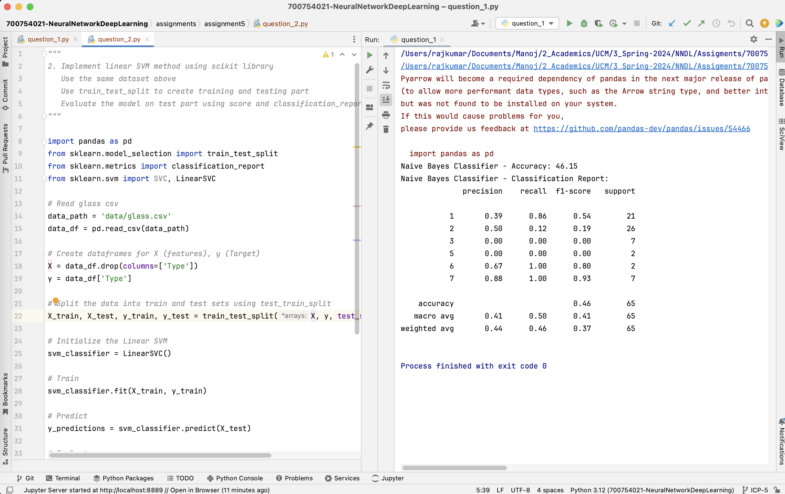
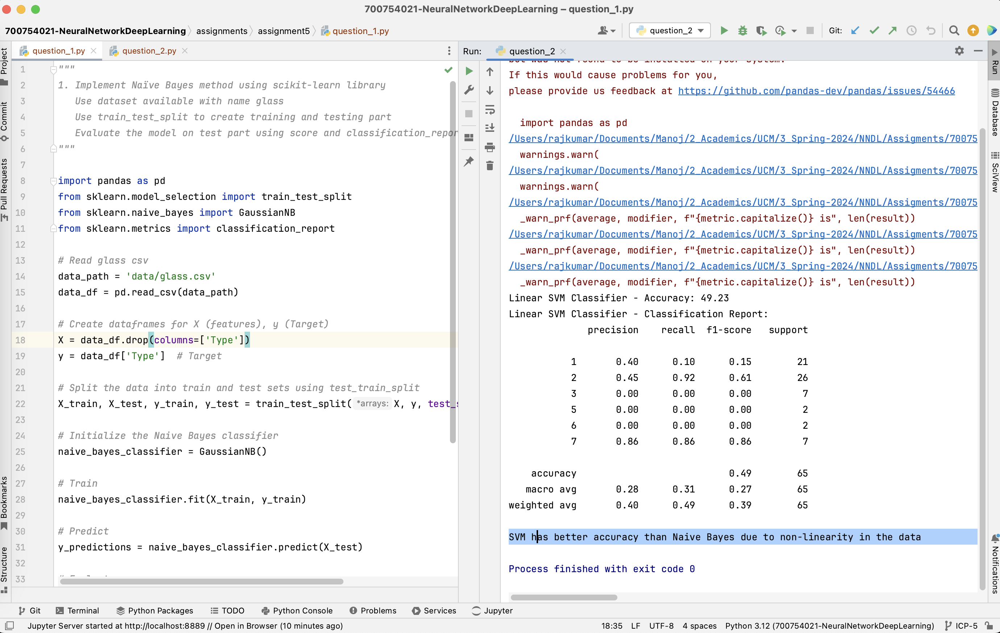

# Assignment 5 :: ICP-5

[PDF Document][1]  
[Short Video][2]

## Table of Contents

1. [Introduction](#introduction)
2. [Basic Details](#basic-details)
3. [Requirements](#requirements)
4. [Instructions](#instructions) 
5. [Solutions](#solutions)
6. [Screenshots](#screenshots)
7. [Recordings](#recordings)

## Introduction

Assignment 5 comprises of 2 questions containing code in individual files
+ question_1.py
+ question_2.py

## Basic Details
| Attribute  | Value                                  | 
|------------|----------------------------------------|
| Name       | Manoj Bala                             |
| Email      | mxb40210@ucmo.edu                      |
| Student Id | 700754021                              |
| CRN        | 23441                                  |
| Course     | CS5720 Neural Networks & Deep Learning |

## Requirements

| Python     | https://www.python.org/            | 
|------------|------------------------------------|
| Pycharm    | https://www.jetbrains.com/pycharm/ |

## Instructions

1. Clone the repository
`git clone git@github.com:mxb40210/700754021-NeuralNetworkDeepLearning.git`
2. Import the project in PyCharm or IDE of your choice
3. Right-click the `<filename>.py` -> Select Run (or) `python3 <filename>.py`

## Solutions

### Solution 1
```
    import pandas as pd
    from sklearn.model_selection import train_test_split
    from sklearn.naive_bayes import GaussianNB
    from sklearn.metrics import classification_report
    
    # Read glass csv
    data_path = 'data/glass.csv'
    data_df = pd.read_csv(data_path)
    
    # Create dataframes for X (features), y (Target)
    X = data_df.drop(columns=['Type'])
    y = data_df['Type']  # Target
    
    # Split the data into train and test sets using test_train_split
    X_train, X_test, y_train, y_test = train_test_split(X, y, test_size=0.3, random_state=42)
    
    # Initialize the Naive Bayes classifier
    naive_bayes_classifier = GaussianNB()
    
    # Train
    naive_bayes_classifier.fit(X_train, y_train)
    
    # Predict
    y_predictions = naive_bayes_classifier.predict(X_test)
    
    # Evaluate
    accuracy = round(naive_bayes_classifier.score(X_test, y_test) * 100, 2)
    classification_report = classification_report(y_test, y_predictions)
    
    print("Naive Bayes Classifier - Accuracy: {}" .format(accuracy))
    print("Naive Bayes Classifier - Classification Report:\n{}" .format(classification_report))
```

### Solution 2
```
    import pandas as pd
    from sklearn.model_selection import train_test_split
    from sklearn.metrics import classification_report
    from sklearn.svm import SVC, LinearSVC
    
    # Read glass csv
    data_path = 'data/glass.csv'
    data_df = pd.read_csv(data_path)
    
    # Create dataframes for X (features), y (Target)
    X = data_df.drop(columns=['Type'])
    y = data_df['Type']
    
    # Split the data into train and test sets using test_train_split
    X_train, X_test, y_train, y_test = train_test_split(X, y, test_size=0.3, random_state=42)
    
    # Initialize the Linear SVM
    svm_classifier = LinearSVC()
    
    # Train
    svm_classifier.fit(X_train, y_train)
    
    # Predict
    y_predictions = svm_classifier.predict(X_test)
    
    # Evaluate
    accuracy = round(svm_classifier.score(X_test, y_test) * 100, 2)
    classification_report = classification_report(y_test, y_predictions)
    
    print("Linear SVM Classifier - Accuracy: {}" .format(accuracy))
    print("Linear SVM Classifier - Classification Report:\n{}" .format(classification_report))
    
    print('SVM has better accuracy than Naive Bayes due to non-linearity in the data')
```


## Screenshots





## Recordings

[][2]

[1]: https://github.com/mxb40210/700754021-NeuralNetworkDeepLearning/blob/main/assignments/assignment5/23441_700754021_ICP-5.pdf
[2]: https://drive.google.com/file/d/1WGJquq5IzOySkYa4v7kqt039411pPnmQ/view?usp=sharing
