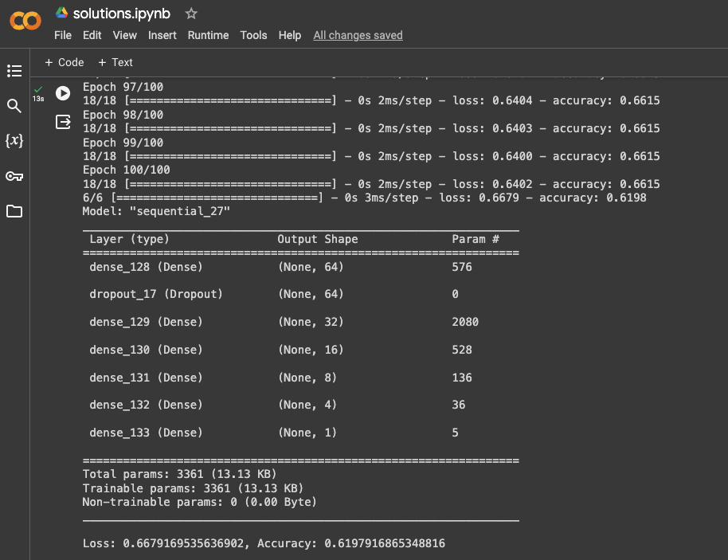
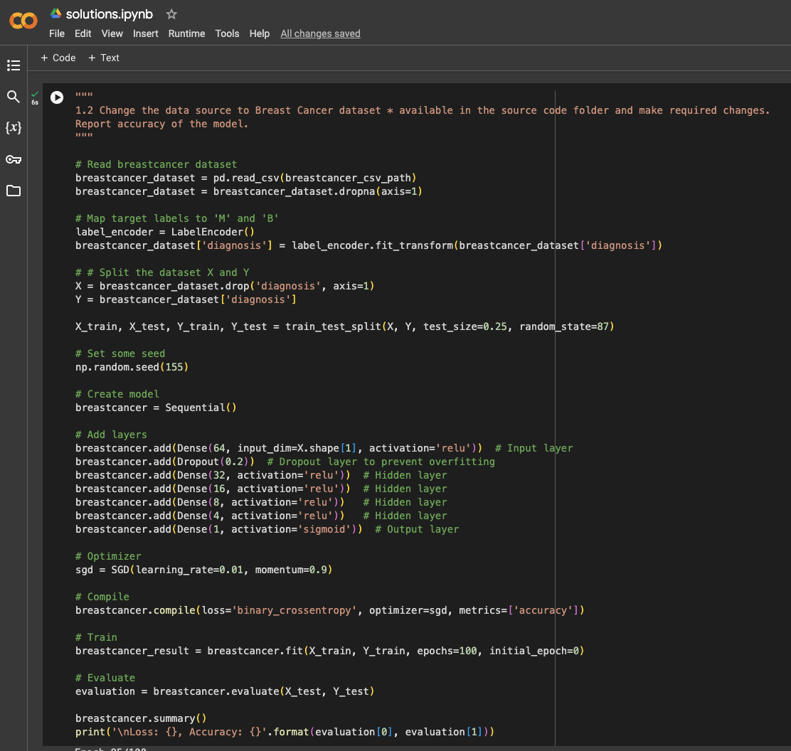
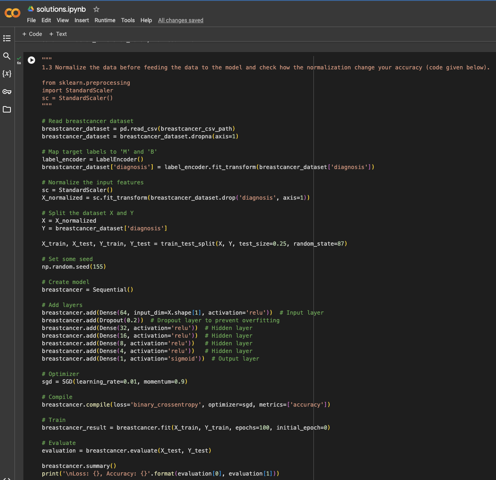
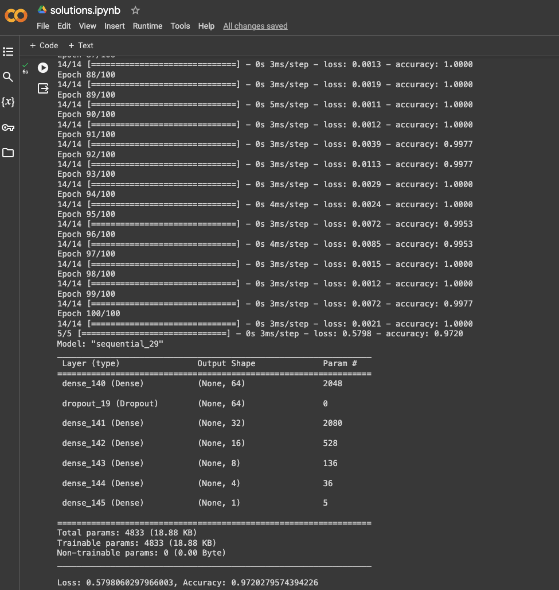
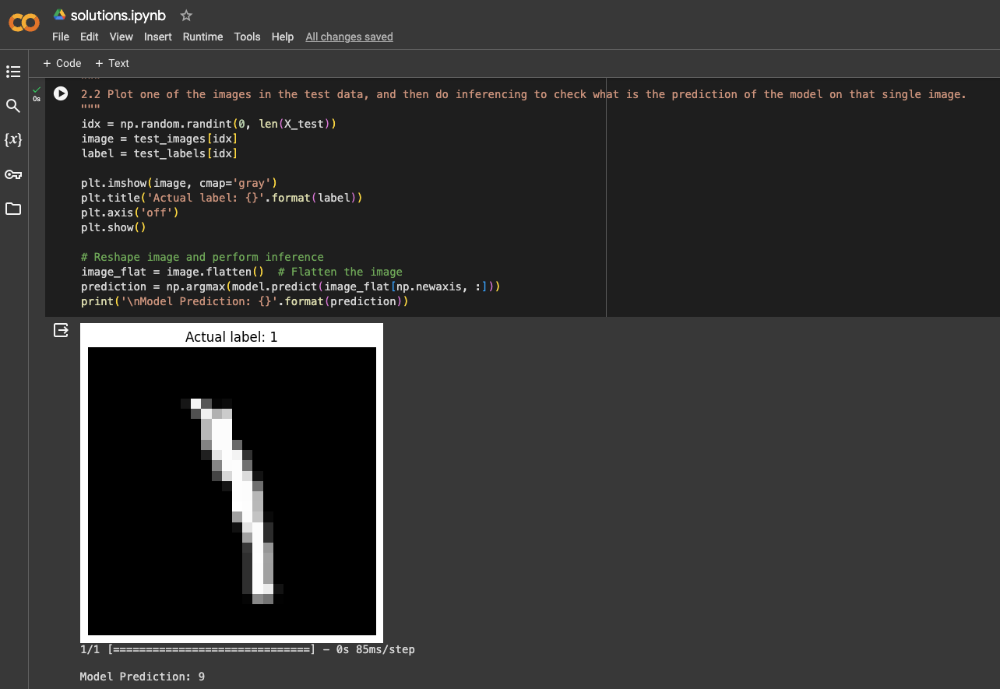
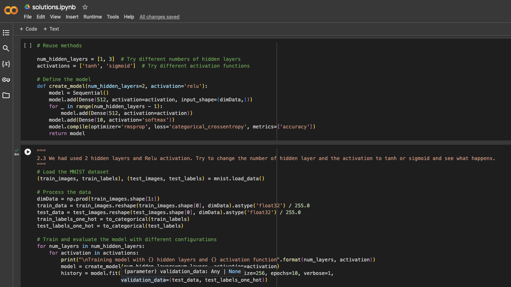

# Assignment 6 :: ICP-6

[PDF Document][1]  
[Short Video][2]

## Table of Contents

1. [Introduction](#introduction)
2. [Basic Details](#basic-details)
3. [Requirements](#requirements)
4. [Instructions](#instructions) 
5. [Solutions](#solutions)
6. [Screenshots](#screenshots)
7. [Recordings](#recordings)

## Introduction

Assignment 6 comprises of 2 questions containing code in one Jupyter Python Notebook
+ solutions.ipynb

## Basic Details
| Attribute  | Value                                  | 
|------------|----------------------------------------|
| Name       | Manoj Bala                             |
| Email      | mxb40210@ucmo.edu                      |
| Student Id | 700754021                              |
| CRN        | 23441                                  |
| Course     | CS5720 Neural Networks & Deep Learning |

## Requirements

| Python     | https://www.python.org/            | 
|------------|------------------------------------|
| Pycharm    | https://www.jetbrains.com/pycharm/ |

## Instructions

1. Clone the repository
`git clone git@github.com:mxb40210/700754021-NeuralNetworkDeepLearning.git`
2. Import the project in PyCharm or IDE of your choice
3. Open the Python Jupyter Notebook `solutions.ipynb`
4. Select Run -> Run all cells

## Solutions

### Solution 1
```
    # Imports
    # Keras related
    from keras.models import Sequential
    from keras.layers import Dense, Activation, Dropout
    from keras.optimizers import SGD
    from keras.datasets import mnist
    from keras.utils import to_categorical
    
    # sklearn related
    from sklearn.model_selection import train_test_split
    from sklearn.preprocessing import LabelEncoder, StandardScaler
    
    # pandas, numpy
    import pandas as pd
    import numpy as np
    
    # Plotting - visualizations
    import matplotlib.pyplot as plt
    
    """
    1.1 Use the use case in the class:
    a. Add more Dense layers to the existing code and check how the accuracy changes.
    """
    
    # Read diabetes dataset
    diabetes_dataset = pd.read_csv(diabetes_csv_path, header=None).values
    
    # Split the dataset X and Y
    X = diabetes_dataset[:, 0:8]
    Y = diabetes_dataset[:, 8]
    
    X_train, X_test, Y_train, Y_test = train_test_split(X, Y, test_size=0.25, random_state=87)
    
    # Set some seed
    np.random.seed(155)
    
    # Create model
    diabetes_model = Sequential() 
    
    # Add layers
    diabetes_model.add(Dense(64, input_dim=8, activation='relu'))  # Input layer
    diabetes_model.add(Dropout(0.2))  # Dropout layer to prevent overfitting
    diabetes_model.add(Dense(32, activation='relu'))  # Hidden layer
    diabetes_model.add(Dense(16, activation='relu'))  # Hidden layer
    diabetes_model.add(Dense(8, activation='relu'))   # Hidden layer
    diabetes_model.add(Dense(4, activation='relu'))   # Hidden layer
    diabetes_model.add(Dense(1, activation='sigmoid'))  # Output layer
    
    # Optimizer
    sgd = SGD(learning_rate=0.01, momentum=0.9)
    
    # Compile
    diabetes_model.compile(loss='binary_crossentropy', optimizer=sgd, metrics=['accuracy'])
    
    # Train
    diabetes_result = diabetes_model.fit(X_train, Y_train, epochs=100, initial_epoch=0)
    
    # Evaluate
    evaluation = diabetes_model.evaluate(X_test, Y_test)
    
    diabetes_model.summary()
    print('\nLoss: {}, Accuracy: {}'.format(evaluation[0], evaluation[1]))
    
    """
    1.2 Change the data source to Breast Cancer dataset * available in the source code folder and make required changes. 
    Report accuracy of the model.
    """
    
    # Read breastcancer dataset
    breastcancer_dataset = pd.read_csv(breastcancer_csv_path)
    breastcancer_dataset = breastcancer_dataset.dropna(axis=1)
    
    # Map target labels to 'M' and 'B'
    label_encoder = LabelEncoder()
    breastcancer_dataset['diagnosis'] = label_encoder.fit_transform(breastcancer_dataset['diagnosis'])
    
    # # Split the dataset X and Y
    X = breastcancer_dataset.drop('diagnosis', axis=1)
    Y = breastcancer_dataset['diagnosis']
    
    X_train, X_test, Y_train, Y_test = train_test_split(X, Y, test_size=0.25, random_state=87)
    
    # Set some seed
    np.random.seed(155)
    
    # Create model
    breastcancer = Sequential() 
    
    # Add layers
    breastcancer.add(Dense(64, input_dim=X.shape[1], activation='relu'))  # Input layer
    breastcancer.add(Dropout(0.2))  # Dropout layer to prevent overfitting
    breastcancer.add(Dense(32, activation='relu'))  # Hidden layer
    breastcancer.add(Dense(16, activation='relu'))  # Hidden layer
    breastcancer.add(Dense(8, activation='relu'))   # Hidden layer
    breastcancer.add(Dense(4, activation='relu'))   # Hidden layer
    breastcancer.add(Dense(1, activation='sigmoid'))  # Output layer
    
    # Optimizer
    sgd = SGD(learning_rate=0.01, momentum=0.9)
    
    # Compile
    breastcancer.compile(loss='binary_crossentropy', optimizer=sgd, metrics=['accuracy'])
    
    # Train
    breastcancer_result = breastcancer.fit(X_train, Y_train, epochs=100, initial_epoch=0)
    
    # Evaluate
    evaluation = breastcancer.evaluate(X_test, Y_test)
    
    breastcancer.summary()
    print('\nLoss: {}, Accuracy: {}'.format(evaluation[0], evaluation[1]))
    
    """
    1.3 Normalize the data before feeding the data to the model and check how the normalization change your accuracy (code given below). 
    
    from sklearn.preprocessing 
    import StandardScaler 
    sc = StandardScaler()
    """
    
    # Read breastcancer dataset
    breastcancer_dataset = pd.read_csv(breastcancer_csv_path)
    breastcancer_dataset = breastcancer_dataset.dropna(axis=1)
    
    # Map target labels to 'M' and 'B'
    label_encoder = LabelEncoder()
    breastcancer_dataset['diagnosis'] = label_encoder.fit_transform(breastcancer_dataset['diagnosis'])
    
    # Normalize the input features
    sc = StandardScaler()
    X_normalized = sc.fit_transform(breastcancer_dataset.drop('diagnosis', axis=1))
    
    # Split the dataset X and Y
    X = X_normalized
    Y = breastcancer_dataset['diagnosis']
    
    X_train, X_test, Y_train, Y_test = train_test_split(X, Y, test_size=0.25, random_state=87)
    
    # Set some seed
    np.random.seed(155)
    
    # Create model
    breastcancer = Sequential() 
    
    # Add layers
    breastcancer.add(Dense(64, input_dim=X.shape[1], activation='relu'))  # Input layer
    breastcancer.add(Dropout(0.2))  # Dropout layer to prevent overfitting
    breastcancer.add(Dense(32, activation='relu'))  # Hidden layer
    breastcancer.add(Dense(16, activation='relu'))  # Hidden layer
    breastcancer.add(Dense(8, activation='relu'))   # Hidden layer
    breastcancer.add(Dense(4, activation='relu'))   # Hidden layer
    breastcancer.add(Dense(1, activation='sigmoid'))  # Output layer
    
    # Optimizer
    sgd = SGD(learning_rate=0.01, momentum=0.9)
    
    # Compile
    breastcancer.compile(loss='binary_crossentropy', optimizer=sgd, metrics=['accuracy'])
    
    # Train
    breastcancer_result = breastcancer.fit(X_train, Y_train, epochs=100, initial_epoch=0)
    
    # Evaluate
    evaluation = breastcancer.evaluate(X_test, Y_test)
    
    breastcancer.summary()
    print('\nLoss: {}, Accuracy: {}'.format(evaluation[0], evaluation[1]))
```

### Solution 2
```
    """
    2.1 Plot the loss and accuracy for both training data and validation data using the history object in the source code.
    """
    plt.figure(figsize=(10, 5))
    
    # Plot training & validation accuracy values
    plt.subplot(1, 2, 1)
    plt.plot(history.history['accuracy'], label='Training Accuracy')
    plt.plot(history.history['val_accuracy'], label='Validation Accuracy')
    plt.title('Model Accuracy')
    plt.xlabel('Epoch')
    plt.ylabel('Accuracy')
    plt.legend()
    
    # Plot training & validation loss values
    plt.subplot(1, 2, 2)
    plt.plot(history.history['loss'], label='Training Loss')
    plt.plot(history.history['val_loss'], label='Validation Loss')
    plt.title('Model Loss')
    plt.xlabel('Epoch')
    plt.ylabel('Loss')
    plt.legend()
    
    plt.show()
    
    """
    2.2 Plot one of the images in the test data, and then do inferencing to check what is the prediction of the model on that single image.
    """
    idx = np.random.randint(0, len(X_test))
    image = test_images[idx]
    label = test_labels[idx]
    
    plt.imshow(image, cmap='gray')
    plt.title('Actual label: {}'.format(label))
    plt.axis('off')
    plt.show()
    
    # Reshape image and perform inference
    image_flat = image.flatten()  # Flatten the image
    prediction = np.argmax(model.predict(image_flat[np.newaxis, :]))
    print('\nModel Prediction: {}'.format(prediction))
    
    # Reuse methods
    
    num_hidden_layers = [1, 3]  # Try different numbers of hidden layers
    activations = ['tanh', 'sigmoid']  # Try different activation functions
    
    # Define the model
    def create_model(num_hidden_layers=2, activation='relu'):
        model = Sequential()
        model.add(Dense(512, activation=activation, input_shape=(dimData,)))
        for _ in range(num_hidden_layers - 1):
            model.add(Dense(512, activation=activation))
        model.add(Dense(10, activation='softmax'))
        model.compile(optimizer='rmsprop', loss='categorical_crossentropy', metrics=['accuracy'])
        return model
        
        """
    2.3 We had used 2 hidden layers and Relu activation. Try to change the number of hidden layer and the activation to tanh or sigmoid and see what happens.
    """
    # Load the MNIST dataset
    (train_images, train_labels), (test_images, test_labels) = mnist.load_data()
    
    # Process the data
    dimData = np.prod(train_images.shape[1:])
    train_data = train_images.reshape(train_images.shape[0], dimData).astype('float32') / 255.0
    test_data = test_images.reshape(test_images.shape[0], dimData).astype('float32') / 255.0
    train_labels_one_hot = to_categorical(train_labels)
    test_labels_one_hot = to_categorical(test_labels)
    
    # Train and evaluate the model with different configurations
    for num_layers in num_hidden_layers:
        for activation in activations:
            print("\nTraining model with {} hidden layers and {} activation function".format(num_layers, activation))
            model = create_model(num_hidden_layers=num_layers, activation=activation)
            history = model.fit(train_data, train_labels_one_hot, batch_size=256, epochs=10, verbose=1,
                                validation_data=(test_data, test_labels_one_hot))
                                
    """
    2.4 Run the same code without scaling the images and check the performance
    """
    # Load the MNIST dataset
    (train_images, train_labels), (test_images, test_labels) = mnist.load_data()
    
    # Process the data
    dimData = np.prod(train_images.shape[1:])
    train_data = train_images.reshape(train_images.shape[0], dimData).astype('float32')
    test_data = test_images.reshape(test_images.shape[0], dimData).astype('float32')
    train_labels_one_hot = to_categorical(train_labels)
    test_labels_one_hot = to_categorical(test_labels)
    
    for num_layers in num_hidden_layers:
        for activation in activations:
            print("\nTraining model with {} hidden layers and {} activation function".format(num_layers, activation))
            model = create_model(num_hidden_layers=num_layers, activation=activation)
            history = model.fit(train_data, train_labels_one_hot, batch_size=256, epochs=10, verbose=1,
                                validation_data=(test_data, test_labels_one_hot))                            
```


## Screenshots












## Recordings

[][2]

[1]: https://github.com/mxb40210/700754021-NeuralNetworkDeepLearning/blob/main/assignments/assignment6/23441_700754021_ICP-6.pdf
[2]: https://drive.google.com/file/d/1pHtINSReESQ-_mldqDzLCNmNfvhWVN6u/view?usp=sharing
