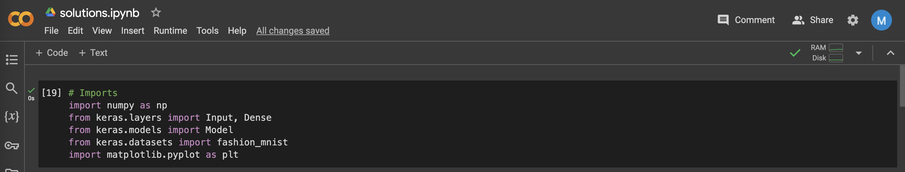
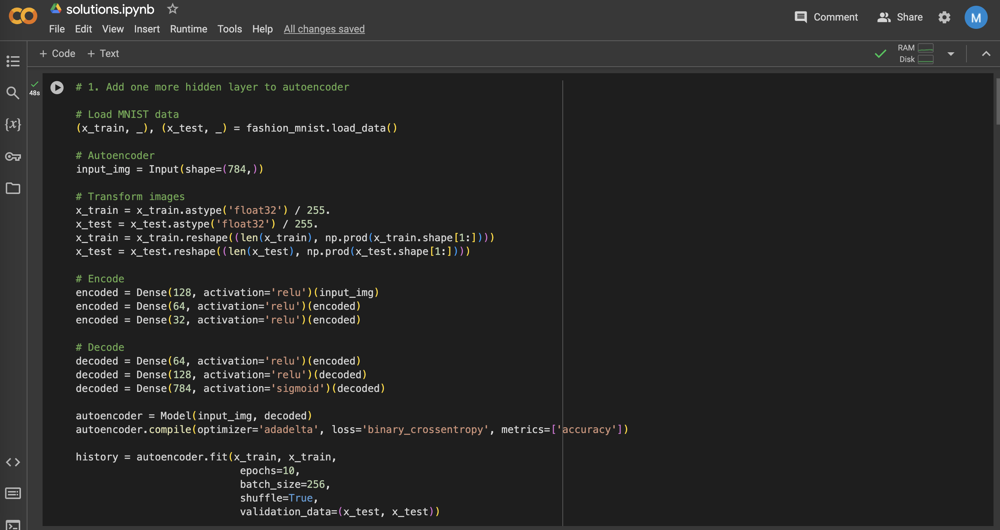
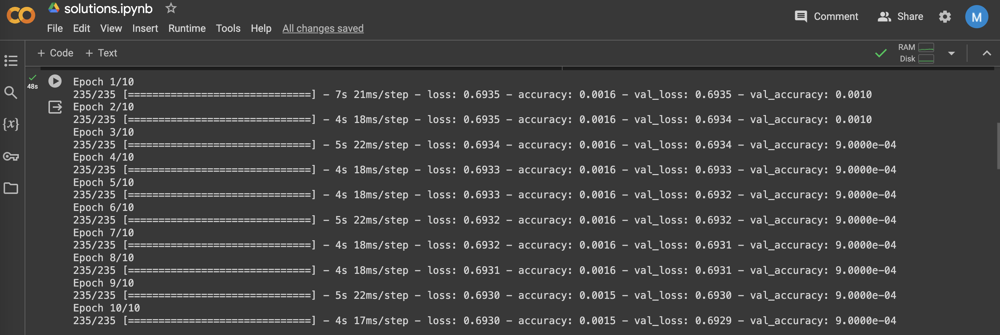
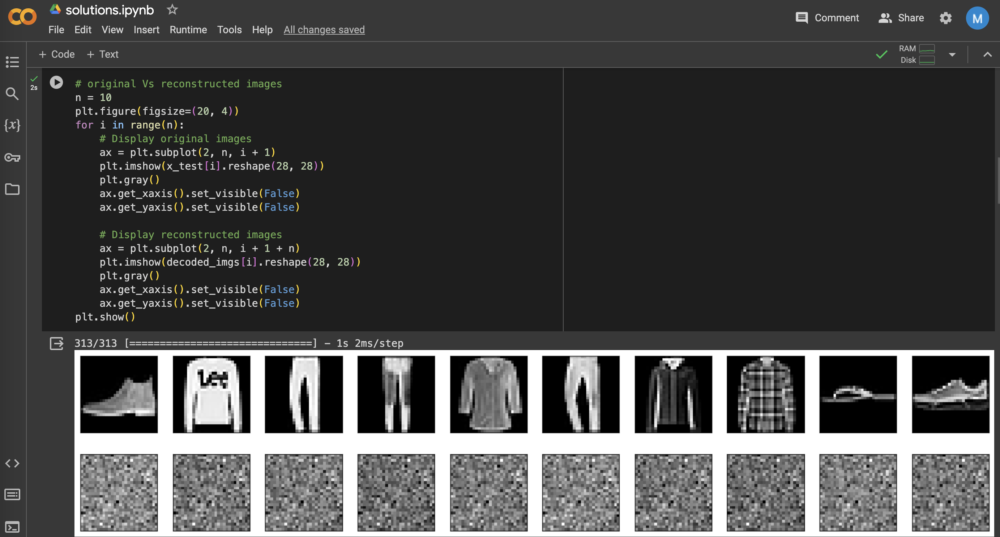
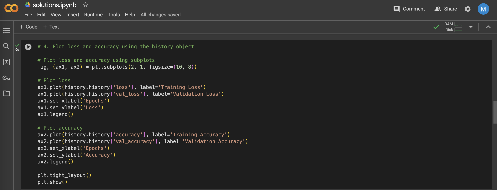
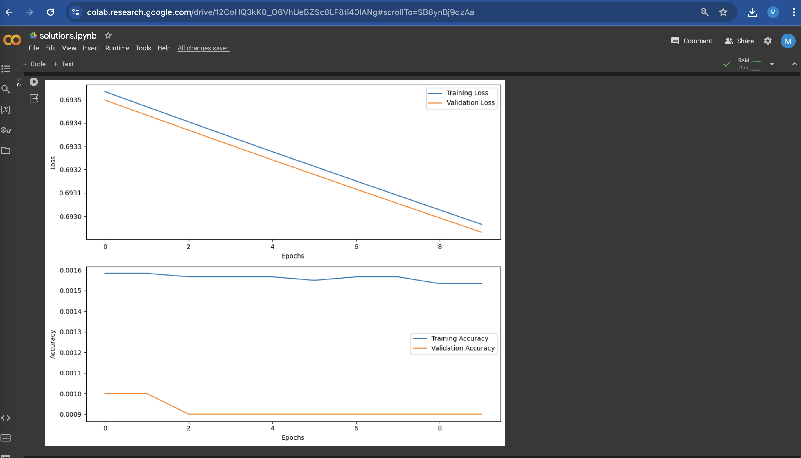
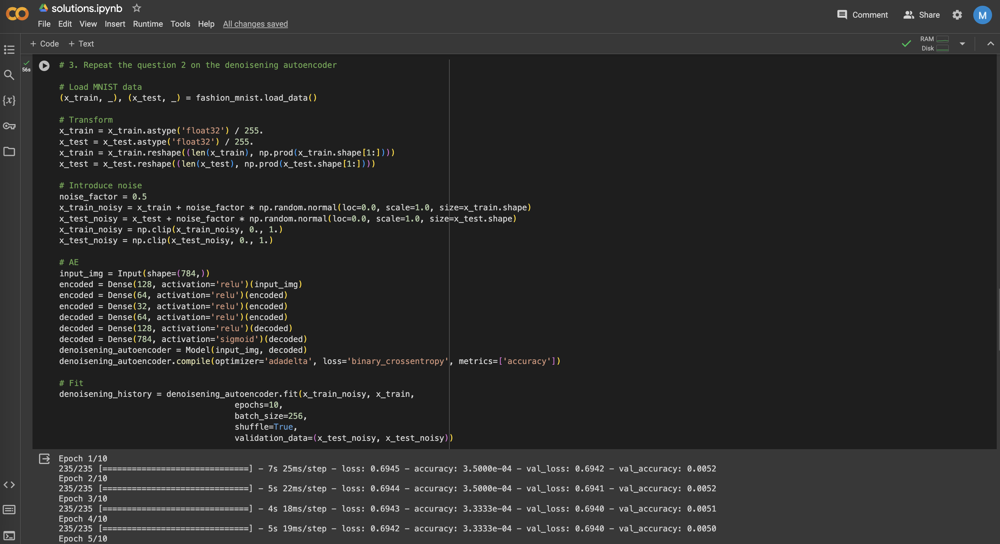
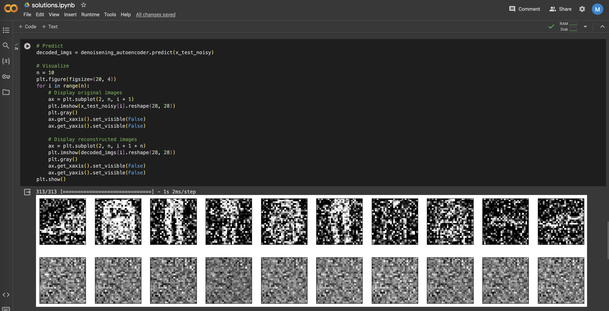
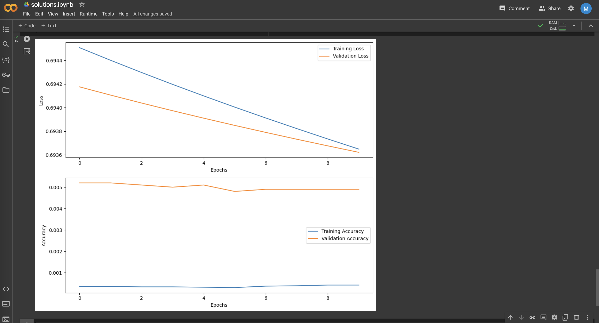

# Assignment 8 :: ICP-8

[PDF Document][1]  
[Short Video][2]

## Table of Contents

1. [Introduction](#introduction)
2. [Basic Details](#basic-details)
3. [Requirements](#requirements)
4. [Instructions](#instructions) 
5. [Solutions](#solutions)
6. [Screenshots](#screenshots)
7. [Recordings](#recordings)

## Introduction

Assignment 8 comprises of 4 questions containing code in one Jupyter Python Notebook
+ solutions.ipynb

## Basic Details
| Attribute  | Value                                  | 
|------------|----------------------------------------|
| Name       | Manoj Bala                             |
| Email      | mxb40210@ucmo.edu                      |
| Student Id | 700754021                              |
| CRN        | 23441                                  |
| Course     | CS5720 Neural Networks & Deep Learning |

## Requirements

| Python     | https://www.python.org/            | 
|------------|------------------------------------|
| Pycharm    | https://www.jetbrains.com/pycharm/ |

## Instructions

1. Clone the repository
`git clone git@github.com:mxb40210/700754021-NeuralNetworkDeepLearning.git`
2. Import the project in PyCharm or IDE of your choice
3. Open the Python Jupyter Notebook `solutions.ipynb`
4. Select Run -> Run all cells

## Solutions

`solutions.ipynb` Jupyter Notebook

## Screenshots

## Recordings

[][2]

[1]: https://github.com/mxb40210/700754021-NeuralNetworkDeepLearning/blob/main/assignments/assignment8/23441_700754021_ICP-8.pdf
[2]: https://drive.google.com/file/d/1ysLPYNb1oDJx6p9x-tkxNBudmCbZdmKz/view?usp=sharing
